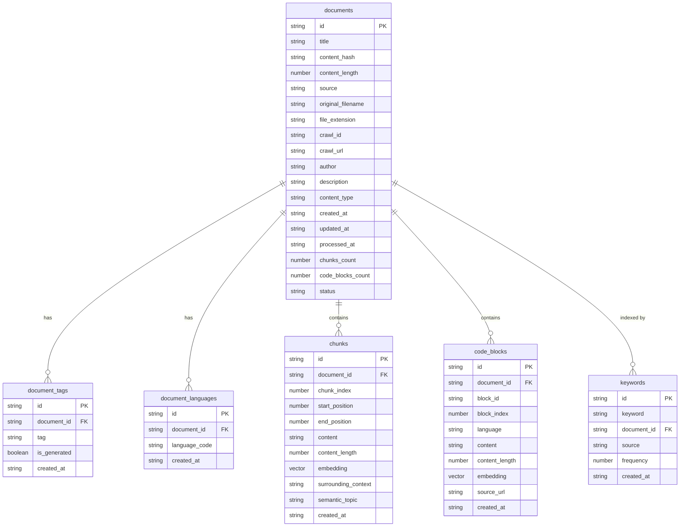

# Saga v1.0.0 Database Schema Reference

Complete reference documentation for the Saga v1.0.0 database schema, including all tables, columns, indexes, and query patterns.

## Table of Contents

- [Overview](#overview)
- [Schema Architecture](#schema-architecture)
- [Table Definitions](#table-definitions)
- [Index Configuration](#index-configuration)
- [Query Patterns](#query-patterns)
- [Performance Considerations](#performance-considerations)
- [Data Relationships](#data-relationships)
- [Schema Constraints](#schema-constraints)

---

## Overview

### Schema Design Principles

The v1.0.0 schema follows these design principles:

1. **Single Source of Truth**: LanceDB is the only persistent storage
2. **Flattened Metadata**: Type-safe columns instead of dynamic structs
3. **Normalized Tables**: Proper relationships for tags, languages
4. **Dynamic Indexing**: IVF_PQ parameters scale with dataset size
5. **Query Optimization**: Comprehensive scalar and vector indexes

### Storage Layout

```
~/.saga/lancedb/
├── documents.lance/         # Document metadata
├── document_tags.lance/     # Tag relationships
├── document_languages.lance/ # Language relationships
├── chunks.lance/            # Text chunks with embeddings
├── code_blocks.lance/       # Code blocks with embeddings
├── keywords.lance/          # Keyword inverted index
└── schema_version.lance/    # Schema compatibility tracking
```

### Schema Version

Current schema version: **1.0.0**

---

## Schema Architecture

### Entity Relationship Diagram



---

## Table Definitions

### Table: `documents`

Stores document-level metadata and search fields. Eliminates need for JSON file storage.

#### Columns

| Column | Type | Nullable | Description | Index |
|--------|------|----------|-------------|-------|
| `id` | string | No | Primary Key - UUID v4 | B-tree |
| `title` | string | No | Document title | - |
| `content_hash` | string | No | SHA-256 hash for deduplication (16 chars) | B-tree |
| `content_length` | number | No | Character count | - |
| `source` | string | No | Source type: 'upload' \| 'crawl' \| 'api' | B-tree |
| `original_filename` | string | Yes | Original filename if uploaded | - |
| `file_extension` | string | Yes | File extension if uploaded | - |
| `crawl_id` | string | Yes | Crawl session ID if crawled | B-tree |
| `crawl_url` | string | Yes | Crawl URL if crawled | - |
| `author` | string | Yes | Document author | - |
| `description` | string | Yes | Document description | - |
| `content_type` | string | Yes | Content type (e.g., 'documentation', 'tutorial') | - |
| `created_at` | string | No | ISO 8601 timestamp - created at | B-tree |
| `updated_at` | string | No | ISO 8601 timestamp - last updated | B-tree |
| `processed_at` | string | No | ISO 8601 timestamp - processed | - |
| `chunks_count` | number | No | Number of chunks | - |
| `code_blocks_count` | number | No | Number of code blocks | - |
| `status` | string | No | Document status: 'active' \| 'archived' \| 'deleted' | B-tree |

#### Constraints

- **Primary Key**: `id`
- **Unique**: `content_hash` (for deduplication)
- **Default**: `status` = 'active'
- **Default**: `chunks_count` = 0
- **Default**: `code_blocks_count` = 0

#### Example Row

```json
{
    "id": "550e8400-e29b-41d4-a716-446655440000",
    "title": "TypeScript Best Practices",
    "content_hash": "a1b2c3d4e5f6a7b8",
    "content_length": 15234,
    "source": "upload",
    "original_filename": "typescript-guide.md",
    "file_extension": "md",
    "crawl_id": null,
    "crawl_url": null,
    "author": "John Doe",
    "description": "Comprehensive guide to TypeScript",
    "content_type": "documentation",
    "created_at": "2026-02-02T10:00:00.000Z",
    "updated_at": "2026-02-02T10:00:00.000Z",
    "processed_at": "2026-02-02T10:00:00.000Z",
    "chunks_count": 45,
    "code_blocks_count": 12,
    "status": "active"
}
```

---

### Table: `document_tags`

Many-to-many relationship for tags. Enables efficient tag-based filtering.

#### Columns

| Column | Type | Nullable | Description | Index |
|--------|------|----------|-------------|-------|
| `id` | string | No | Primary Key - UUID v4 | - |
| `document_id` | string | No | Foreign key to documents.id | B-tree |
| `tag` | string | No | Tag value (lowercase) | B-tree |
| `is_generated` | boolean | No | True if AI-generated tag | - |
| `created_at` | string | No | ISO 8601 timestamp | - |

#### Constraints

- **Primary Key**: `id`
- **Foreign Key**: `document_id` → `documents.id`
- **Default**: `is_generated` = false
- **Unique**: `(document_id, tag)` (implicit via application logic)

#### Example Row

```json
{
    "id": "660e8400-e29b-41d4-a716-446655440001",
    "document_id": "550e8400-e29b-41d4-a716-446655440000",
    "tag": "typescript",
    "is_generated": false,
    "created_at": "2026-02-02T10:00:00.000Z"
}
```

---

### Table: `document_languages`

Many-to-many relationship for languages. Enables efficient language-based filtering.

#### Columns

| Column | Type | Nullable | Description | Index |
|--------|------|----------|-------------|-------|
| `id` | string | No | Primary Key - UUID v4 | - |
| `document_id` | string | No | Foreign key to documents.id | B-tree |
| `language_code` | string | No | ISO 639-1 code (e.g., 'en', 'no') | B-tree |
| `created_at` | string | No | ISO 8601 timestamp | - |

#### Constraints

- **Primary Key**: `id`
- **Foreign Key**: `document_id` → `documents.id`
- **Unique**: `(document_id, language_code)` (implicit via application logic)

#### Example Row

```json
{
    "id": "770e8400-e29b-41d4-a716-446655440001",
    "document_id": "550e8400-e29b-41d4-a716-446655440000",
    "language_code": "en",
    "created_at": "2026-02-02T10:00:00.000Z"
}
```

---

### Table: `chunks`

Stores text chunks with embeddings. Metadata flattened for type safety.

#### Columns

| Column | Type | Nullable | Description | Index |
|--------|------|----------|-------------|-------|
| `id` | string | No | Primary Key - UUID v4 | - |
| `document_id` | string | No | Foreign key to documents.id | B-tree |
| `chunk_index` | number | No | Position within document | B-tree |
| `start_position` | number | No | Character start position | - |
| `end_position` | number | No | Character end position | - |
| `content` | string | No | Chunk text content | - |
| `content_length` | number | No | Character count | B-tree |
| `embedding` | vector | No | Vector embedding (fixed dimension) | IVF_PQ |
| `surrounding_context` | string | Yes | Context before/after chunk | - |
| `semantic_topic` | string | Yes | AI-generated topic | - |
| `created_at` | string | No | ISO 8601 timestamp | B-tree |

#### Constraints

- **Primary Key**: `id`
- **Foreign Key**: `document_id` → `documents.id`
- **Unique**: `(document_id, chunk_index)` (implicit via application logic)

#### Example Row

```json
{
    "id": "880e8400-e29b-41d4-a716-446655440001",
    "document_id": "550e8400-e29b-41d4-a716-446655440000",
    "chunk_index": 0,
    "start_position": 0,
    "end_position": 512,
    "content": "TypeScript is a strongly typed programming language...",
    "content_length": 512,
    "embedding": [0.1, 0.2, 0.3, ...],
    "surrounding_context": "Introduction to TypeScript...",
    "semantic_topic": "programming languages",
    "created_at": "2026-02-02T10:00:00.000Z"
}
```

---

### Table: `code_blocks`

Stores code blocks with embeddings. Language-specific search optimized.

#### Columns

| Column | Type | Nullable | Description | Index |
|--------|------|----------|-------------|-------|
| `id` | string | No | Primary Key - UUID v4 | - |
| `document_id` | string | No | Foreign key to documents.id | B-tree |
| `block_id` | string | No | Original block identifier | - |
| `block_index` | number | No | Position within document | B-tree |
| `language` | string | No | Normalized language tag | B-tree |
| `content` | string | No | Code text | - |
| `content_length` | number | No | Character count | B-tree |
| `embedding` | vector | No | Vector embedding (fixed dimension) | IVF_PQ |
| `source_url` | string | Yes | Original source URL | - |
| `created_at` | string | No | ISO 8601 timestamp | B-tree |

#### Constraints

- **Primary Key**: `id`
- **Foreign Key**: `document_id` → `documents.id`
- **Unique**: `(document_id, block_index)` (implicit via application logic)

#### Example Row

```json
{
    "id": "990e8400-e29b-41d4-a716-446655440001",
    "document_id": "550e8400-e29b-41d4-a716-446655440000",
    "block_id": "code-001",
    "block_index": 0,
    "language": "typescript",
    "content": "interface User {\n  name: string;\n  age: number;\n}",
    "content_length": 45,
    "embedding": [0.2, 0.3, 0.4, ...],
    "source_url": "https://example.com/code",
    "created_at": "2026-02-02T10:00:00.000Z"
}
```

---

### Table: `keywords`

Inverted index for keyword search. Replaces in-memory keyword index.

#### Columns

| Column | Type | Nullable | Description | Index |
|--------|------|----------|-------------|-------|
| `id` | string | No | Primary Key - UUID v4 | - |
| `keyword` | string | No | Lowercase keyword | B-tree |
| `document_id` | string | No | Foreign key to documents.id | B-tree |
| `source` | string | No | Where keyword was found: 'title' \| 'content' | - |
| `frequency` | number | No | Occurrence count | - |
| `created_at` | string | No | ISO 8601 timestamp | - |

#### Constraints

- **Primary Key**: `id`
- **Foreign Key**: `document_id` → `documents.id`
- **Unique**: `(keyword, document_id)` (implicit via application logic)

#### Example Row

```json
{
    "id": "a00e8400-e29b-41d4-a716-446655440001",
    "keyword": "typescript",
    "document_id": "550e8400-e29b-41d4-a716-446655440000",
    "source": "title",
    "frequency": 3,
    "created_at": "2026-02-02T10:00:00.000Z"
}
```

---

### Table: `schema_version`

Tracks schema version for compatibility checks.

#### Columns

| Column | Type | Nullable | Description | Index |
|--------|------|----------|-------------|-------|
| `id` | number | No | Auto-increment primary key | - |
| `version` | string | No | Semantic version (e.g., '1.0.0') | - |
| `applied_at` | string | No | ISO 8601 timestamp | - |
| `description` | string | No | Migration description | - |

#### Constraints

- **Primary Key**: `id`
- **Unique**: `version`

#### Example Row

```json
{
    "id": 1,
    "version": "1.0.0",
    "applied_at": "2026-02-02T10:00:00.000Z",
    "description": "Migrated to v1.0.0 schema with flattened metadata and normalized tables"
}
```

---

## Index Configuration

### Vector Indexes

#### IVF_PQ Configuration

Vector indexes use IVF_PQ (Inverted File with Product Quantization) with parameters scaled based on dataset size.

```typescript
interface VectorIndexConfig {
    type: 'ivf_pq';
    metricType: 'cosine' | 'l2' | 'dot';
    num_partitions: number;
    num_sub_vectors: number;
}
```

#### Dynamic Parameter Calculation

```typescript
function calculateIVF_PQ_Params(vectorCount: number, embeddingDim: number): VectorIndexConfig {
    const numPartitions = Math.max(16, Math.floor(Math.sqrt(vectorCount)));
    const numSubVectors = Math.max(4, Math.floor(embeddingDim / 16));
    
    return {
        type: 'ivf_pq',
        metricType: 'cosine',
        num_partitions: Math.min(numPartitions, 2048),
        num_sub_vectors: Math.min(numSubVectors, 256)
    };
}
```

#### Vector Index Tables

| Table | Column | Index Type | Metric | Parameters |
|-------|--------|------------|--------|------------|
| `chunks` | `embedding` | IVF_PQ | Cosine | Dynamic |
| `code_blocks` | `embedding` | IVF_PQ | Cosine | Dynamic |

#### Configuration by Dataset Size

| Vector Count | num_partitions | num_sub_vectors | Index Build Time (est.) |
|--------------|----------------|-----------------|-------------------------|
| < 10K | 100 | 8 | < 30s |
| 10K - 100K | 316 | 16 | < 2 min |
| 100K - 1M | 1,000 | 32 | < 5 min |
| 1M - 10M | 3,162 | 64 | < 15 min |
| > 10M | 10,000 | 128 | < 30 min |

### Scalar Indexes

Scalar indexes on frequently filtered columns for fast exact match queries.

#### Scalar Index Tables

| Table | Columns | Index Type | Purpose |
|-------|---------|------------|---------|
| `documents` | `id`, `content_hash`, `source`, `crawl_id`, `status`, `created_at` | B-tree | Primary lookups and filtering |
| `chunks` | `document_id`, `chunk_index`, `created_at` | B-tree | Document queries and ordering |
| `code_blocks` | `document_id`, `block_index`, `language`, `created_at` | B-tree | Language filtering and ordering |
| `document_tags` | `document_id`, `tag` | B-tree | Tag-based queries |
| `document_languages` | `document_id`, `language_code` | B-tree | Language filtering |
| `keywords` | `keyword`, `document_id` | B-tree | Keyword search |

#### Index Creation Order

Indexes should be created in this order to optimize build time:

```typescript
const indexCreationOrder = [
    // Phase 1: Scalar indexes (fast)
    { table: 'documents', column: 'id', type: 'btree' },
    { table: 'documents', column: 'content_hash', type: 'btree' },
    { table: 'documents', column: 'source', type: 'btree' },
    { table: 'documents', column: 'crawl_id', type: 'btree' },
    { table: 'documents', column: 'status', type: 'btree' },
    { table: 'documents', column: 'created_at', type: 'btree' },
    
    { table: 'chunks', column: 'document_id', type: 'btree' },
    { table: 'chunks', column: 'chunk_index', type: 'btree' },
    { table: 'chunks', column: 'created_at', type: 'btree' },
    
    { table: 'code_blocks', column: 'document_id', type: 'btree' },
    { table: 'code_blocks', column: 'block_index', type: 'btree' },
    { table: 'code_blocks', column: 'language', type: 'btree' },
    { table: 'code_blocks', column: 'created_at', type: 'btree' },
    
    { table: 'document_tags', column: 'document_id', type: 'btree' },
    { table: 'document_tags', column: 'tag', type: 'btree' },
    
    { table: 'document_languages', column: 'document_id', type: 'btree' },
    { table: 'document_languages', column: 'language_code', type: 'btree' },
    
    { table: 'keywords', column: 'keyword', type: 'btree' },
    { table: 'keywords', column: 'document_id', type: 'btree' },
    
    // Phase 2: Vector indexes (slow, do last)
    { table: 'chunks', column: 'embedding', type: 'ivf_pq', params: 'dynamic' },
    { table: 'code_blocks', column: 'embedding', type: 'ivf_pq', params: 'dynamic' },
];
```

---

## Query Patterns

### Vector Search

#### Basic Vector Search

```typescript
import { LanceDBV1 } from './src/vector-db/lance-db-v1.js';

const db = new LanceDBV1('~/.saga/lancedb');
await db.initialize();

// Query by vector embedding
const results = await db.queryByVector(embedding, {
    limit: 10,
    offset: 0,
    include_metadata: true
});

console.log('Results:', results.results);
console.log('Pagination:', results.pagination);

await db.close();
```

#### Vector Search with Filters

```typescript
const results = await db.queryByVector(embedding, {
    limit: 10,
    filters: {
        tags: ['typescript', 'react'],
        languages: ['en'],
        source: ['upload'],
        status: ['active'],
        crawl_id: 'crawl-123'
    },
    include_metadata: true
});
```

#### Vector Search with Date Filters

```typescript
const results = await db.queryByVector(embedding, {
    limit: 10,
    filters: {
        created_after: '2026-01-01T00:00:00.000Z',
        created_before: '2026-02-01T00:00:00.000Z',
        updated_after: '2026-01-15T00:00:00.000Z'
    }
});
```

### Document Retrieval

#### Get Document by ID

```typescript
const document = await db.getDocument('550e8400-e29b-41d4-a716-446655440000');

if (document) {
    console.log('Title:', document.title);
    console.log('Content length:', document.content_length);
    console.log('Status:', document.status);
}
```

#### Get All Chunks for Document

```typescript
const chunks = await db.queryByDocumentId('550e8400-e29b-41d4-a716-446655440000');

console.log(`Found ${chunks.length} chunks`);
for (const chunk of chunks) {
    console.log(`Chunk ${chunk.chunk_index}: ${chunk.content.substring(0, 50)}...`);
}
```

### Tag-Based Queries

#### Query by Tags

```typescript
const documentIds = await db.queryByTags(['typescript', 'react']);

console.log(`Found ${documentIds.length} documents with tags`);
for (const docId of documentIds) {
    const doc = await db.getDocument(docId);
    console.log(`- ${doc?.title}`);
}
```

#### Tag Filtering in Vector Search

```typescript
const results = await db.queryByVector(embedding, {
    limit: 10,
    filters: {
        tags: ['typescript', 'best-practices']
    }
});
```

### Keyword Search

#### Query by Keywords

```typescript
const keywordResults = await db.queryByKeywords(['typescript', 'interface', 'type']);

console.log('Keyword search results:');
for (const result of keywordResults) {
    console.log(`Document ${result.document_id}: score ${result.score}`);
}
```

#### Combined Vector + Keyword Search

```typescript
// Vector search
const vectorResults = await db.queryByVector(embedding, { limit: 10 });

// Keyword search
const keywordResults = await db.queryByKeywords(['typescript']);

// Combine results (simple example)
const combinedResults = vectorResults.results.filter(result => 
    keywordResults.some(kr => kr.document_id === result.document_id)
);
```

### Language-Based Queries

#### Query by Language

```typescript
// Get documents with specific language
const results = await db.queryByVector(embedding, {
    limit: 10,
    filters: {
        languages: ['en']
    }
});
```

#### Multi-Language Queries

```typescript
// Query documents in multiple languages
const results = await db.queryByVector(embedding, {
    limit: 10,
    filters: {
        languages: ['en', 'no', 'de']
    }
});
```

### Source-Based Queries

#### Query by Source Type

```typescript
// Query uploaded documents
const results = await db.queryByVector(embedding, {
    limit: 10,
    filters: {
        source: ['upload']
    }
});
```

#### Query by Crawl Session

```typescript
// Query documents from specific crawl
const results = await db.queryByVector(embedding, {
    limit: 10,
    filters: {
        crawl_id: 'crawl-20260202-001'
    }
});
```

### Status-Based Queries

#### Query Active Documents

```typescript
const results = await db.queryByVector(embedding, {
    limit: 10,
    filters: {
        status: ['active']
    }
});
```

#### Query Archived Documents

```typescript
const results = await db.queryByVector(embedding, {
    limit: 10,
    filters: {
        status: ['archived']
    }
});
```

### Pagination

#### Basic Pagination

```typescript
// First page
const page1 = await db.queryByVector(embedding, {
    limit: 10,
    offset: 0
});

// Second page
const page2 = await db.queryByVector(embedding, {
    limit: 10,
    offset: 10
});

// Check if more pages available
if (page1.pagination.has_more) {
    const nextOffset = page1.pagination.next_offset;
}
```

#### Pagination with Filters

```typescript
const results = await db.queryByVector(embedding, {
    limit: 10,
    offset: 20,
    filters: {
        tags: ['typescript'],
        status: ['active']
    }
});

console.log(`Showing ${results.pagination.returned} of ${results.pagination.total_documents} results`);
```

---

## Performance Considerations

### Query Performance Targets

| Metric | Target | Measurement |
|--------|--------|-------------|
| Vector search (top-10) | < 100ms | End-to-end query time |
| Scalar filter (document_id) | < 10ms | Index lookup time |
| Tag filter query | < 50ms | Filter + fetch time |
| Keyword search | < 75ms | Inverted index lookup |
| Combined query (vector + filters) | < 150ms | Complex query time |
| Concurrent queries (10) | < 200ms | Under load |

### Index Build Performance

| Dataset Size | Target Build Time | Notes |
|--------------|-------------------|-------|
| 10K vectors | < 30s | Initial index |
| 100K vectors | < 2 min | With optimal params |
| 1M vectors | < 5 min | Dynamic IVF_PQ |
| 10M vectors | < 15 min | Large dataset |

### Memory Usage

| Metric | Target | Notes |
|--------|--------|-------|
| 100K documents | < 2GB | Including indexes |
| 1M documents | < 8GB | Scaled linearly |
| Per-document overhead | < 20KB | Average across tables |
| Cache hit rate | > 50% | For hot queries |

### Storage Efficiency

| Metric | Target | Notes |
|--------|--------|-------|
| Compression ratio | > 2:1 | IVF_PQ compression |
| Storage overhead | < 30% | Indexes + metadata |
| Deduplication savings | > 5% | Content hash indexing |

### Optimization Tips

#### 1. Use Appropriate Batch Sizes

```typescript
// For large inserts, use batch sizes of 1000-2000
await db.addChunks(chunks, 1000);
await db.addCodeBlocks(codeBlocks, 1000);
```

#### 2. Leverage Scalar Indexes

```typescript
// Always filter by indexed columns when possible
const results = await db.queryByVector(embedding, {
    filters: {
        document_id: 'specific-id',  // Uses scalar index
        status: 'active'             // Uses scalar index
    }
});
```

#### 3. Minimize Metadata Fetching

```typescript
// Only fetch metadata when needed
const results = await db.queryByVector(embedding, {
    limit: 10,
    include_metadata: false  // Faster queries
});
```

#### 4. Use Pagination for Large Results

```typescript
// Don't fetch all results at once
const results = await db.queryByVector(embedding, {
    limit: 10,
    offset: 0
});
```

#### 5. Optimize Vector Index Parameters

```typescript
// For small datasets, use fewer partitions
const smallDatasetConfig = {
    num_partitions: 100,
    num_sub_vectors: 8
};

// For large datasets, use more partitions
const largeDatasetConfig = {
    num_partitions: 1000,
    num_sub_vectors: 32
};
```

---

## Data Relationships

### Document to Chunks

One-to-many relationship: A document contains multiple chunks.

```typescript
// Get all chunks for a document
const chunks = await db.queryByDocumentId(documentId);

// Chunks are ordered by chunk_index
chunks.sort((a, b) => a.chunk_index - b.chunk_index);
```

### Document to Code Blocks

One-to-many relationship: A document contains multiple code blocks.

```typescript
// Get all code blocks for a document
// (This requires a custom query or filtering)
const codeBlocks = await db.queryByVector(embedding, {
    filters: {
        document_id: documentId
    }
});
```

### Document to Tags

Many-to-many relationship: A document has multiple tags, a tag belongs to multiple documents.

```typescript
// Get tags for a document
const documentIds = await db.queryByTags(['typescript']);
```

### Document to Languages

Many-to-many relationship: A document has multiple languages, a language belongs to multiple documents.

```typescript
// Get documents with specific languages
const results = await db.queryByVector(embedding, {
    filters: {
        languages: ['en', 'no']
    }
});
```

### Document to Keywords

One-to-many relationship: A document has multiple keywords.

```typescript
// Get documents matching keywords
const keywordResults = await db.queryByKeywords(['typescript', 'interface']);
```

---

## Schema Constraints

### Data Integrity

#### Unique Constraints

- `documents.id` - Primary key, unique
- `documents.content_hash` - Unique (for deduplication)
- `schema_version.version` - Unique

#### Foreign Key Constraints

- `document_tags.document_id` → `documents.id`
- `document_languages.document_id` → `documents.id`
- `chunks.document_id` → `documents.id`
- `code_blocks.document_id` → `documents.id`
- `keywords.document_id` → `documents.id`

#### Application-Level Constraints

- `(document_id, tag)` unique in `document_tags`
- `(document_id, language_code)` unique in `document_languages`
- `(document_id, chunk_index)` unique in `chunks`
- `(document_id, block_index)` unique in `code_blocks`
- `(keyword, document_id)` unique in `keywords`

### Data Validation

#### Content Hash

```typescript
// Content hash is SHA-256 truncated to 16 chars
function calculateContentHash(content: string): string {
    const hash = crypto.createHash('sha256').update(content).digest('hex');
    return hash.substring(0, 16);
}
```

#### Language Codes

```typescript
// Language codes must be ISO 639-1 (2-letter codes)
const validLanguageCodes = ['en', 'no', 'de', 'fr', 'es', 'it', 'pt', 'ru', 'zh', 'ja', 'ko'];
```

#### Source Types

```typescript
// Source must be one of: 'upload', 'crawl', 'api'
type SourceType = 'upload' | 'crawl' | 'api';
```

#### Status Values

```typescript
// Status must be one of: 'active', 'archived', 'deleted'
type DocumentStatus = 'active' | 'archived' | 'deleted';
```

### Timestamps

All timestamps use ISO 8601 format:

```typescript
const timestamp = new Date().toISOString();
// Example: "2026-02-02T10:00:00.000Z"
```

---

## Additional Resources

- [API Reference](./database-v1-api-reference.md) - LanceDBV1 API documentation
- [Design Document](../plans/database-schema-v1-design.md) - Detailed design rationale
- [Type Definitions](../src/types/database-v1.ts) - TypeScript type definitions

---

**Last Updated**: 2026-02-02
**Schema Version**: 1.0.0
